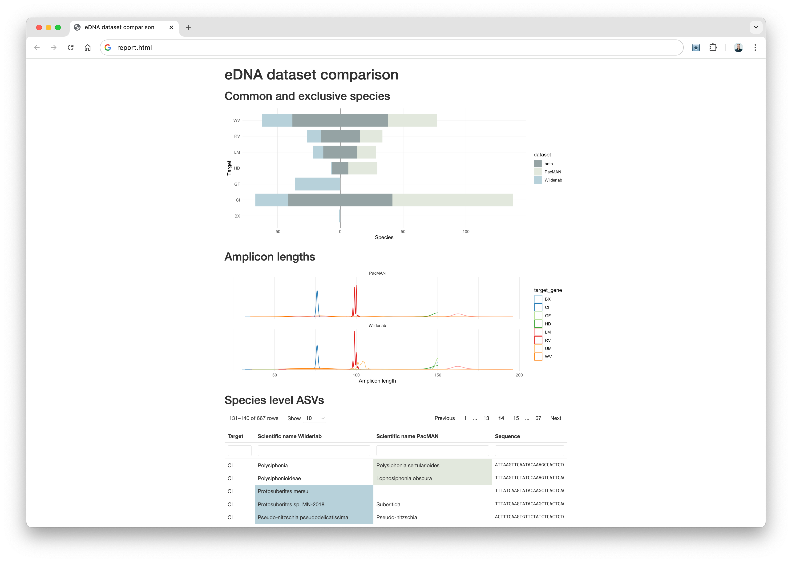

# ednacompare

R package for comparing Darwin Core formatted eDNA datasets.

```r
ds_1 <- read_dataset(system.file("extdata/wilderlab_dwca", package = "ednacompare"))
ds_2 <- read_dataset(system.file("extdata/pacman_dwca", package = "ednacompare"))

compare_datasets(ds_1, ds_2, c("Wilderlab", "PacMAN")) |>
  generate_comparison_report("report.html")
```


